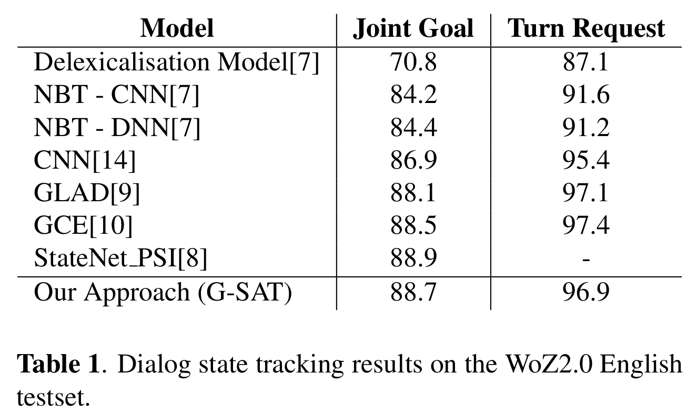
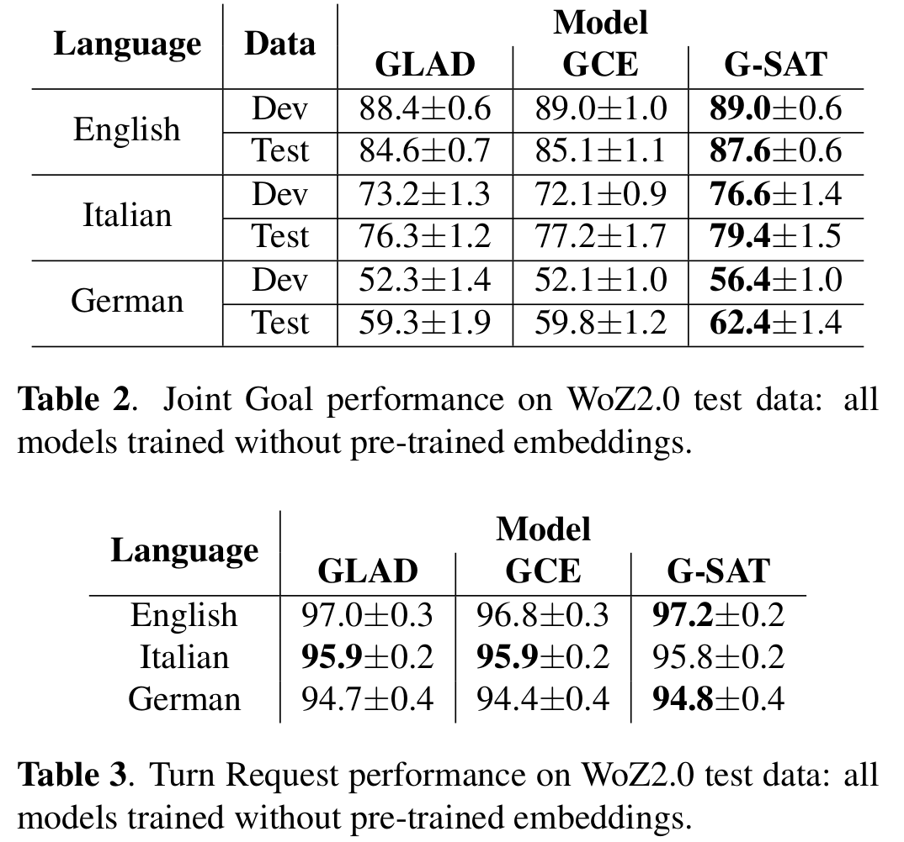
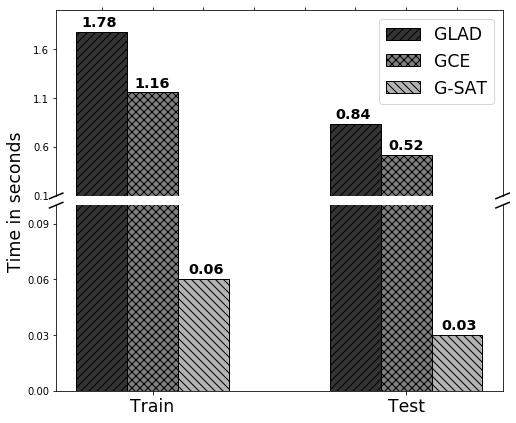

# G-SAT: Scalable Neural Dialogue State Tracking

[](https://pytorch.org/)[](https://opensource.org/licenses/MIT) 

[](https://www.unitn.it/)
[](https://www.fbk.eu/en/)

This is a PyTorch implementation of the paper: <strong>Scalable Neural Dialogue State Tracking.</strong> [Vevake Balaraman](https://scholar.google.it/citations?hl=it&user=GTtAXeIAAAAJ) and [Bernardo Magnini](https://scholar.google.it/citations?user=jnQE-4gAAAAJ&hl=it&oi=ao). [<strong>ASRU 2019</strong>](http://asru2019.org/wp/). [PDF](https://arxiv.org/abs/1910.09942)

# Abstract
A Dialogue State Tracker (DST) is a key component in a dialogue system aiming at estimating the beliefs of possible user goals at each dialogue turn.
Most of the current DST trackers make use of recurrent neural networks and are based on complex architectures that manage several aspects of a dialogue, including the user utterance, the system actions, and the slot-value pairs defined in a domain ontology. However, the complexity of such neural architectures incurs into a considerable latency in the dialogue state prediction, which limits the deployments of the models in real-world applications, particularly when task scalability (i.e. amount of slots) is a crucial factor.
In this paper, we propose an innovative neural model for dialogue state tracking, named <strong>G</strong>lobal encoder and <strong>S</strong>lot-<strong>At</strong>tentive decoders (G-SAT), which can predict the dialogue state with a very low latency time, while maintaining high-level performance. 
We report experiments on three different languages (English, Italian, and German) of the WOZ2.0 dataset, and show that the proposed approach provides competitive advantages over state-of-art DST systems, both in terms of accuracy and in terms of time complexity for predictions, being over 15 times faster than the other systems.

# Citation
The bibtex is below.
```
@article{balaraman2019scalable,
    title={Scalable Neural Dialogue State Tracking},
    author={Vevake Balaraman and Bernardo Magnini},
    year={2019},
    eprint={1910.09942},
    archivePrefix={arXiv},
    primaryClass={cs.CL}
}
```

# Dataset
The [WoZ2.0 dataset](http://mi.eng.cam.ac.uk/~sjy/papers/mowt17.pdf) is used for the experiments. Thanks to [Nikola Mrksic](https://github.com/nmrksic) for making it publicly available.


# Requirements
The required packages to run the program are available in ```requirements.txt``` and can be installed using following command.
```
pip install requirements.txt
```

# Executing the program

1. Download and preprocess the data. The following script downloads datset for all 3 languages (<em>en</em>, <em>it</em> and <em>de</em>).
    ```
    python preprocess_data.py
    ```

2. Train the model
    ```
    python train.py --lang <en/it/de> --seed <SEED NUMBER> --data_dir <DIR. TO SAVE PREPROCESSED DATA> --save_dir <DIR. TO SAVE TRAINED MODEL> --emb_dim <EMBEDDING DIM> 
    ```

    All parameters are optional. To run in default config, run ```python train.py```. Default random seed is 123, to run with different random seeds, use --seed parameter. More options for the model can be found in ```config.py``` file.

3. Test the performance on testset
    ```
    python test.py 
    ```
    If default parameters were modified while training, input the same while testing as well.
# Result
The results of the proposed approach are averaged over 10 different random initializations. Table 1 shows results for pre-trained embeddings and Table 2 & 3 are results without pre-trained embeddings.
<p align="center">

</p>
<p align="center">

</p>

# Time complexity of different models
Time complexity of various models for each batch of size 50 during training and testing (low execution time means low latency in prediction).

<p align="center">

</p>

# Contact
Please feel free to contact me at balaraman@fbk.eu for any queries.

# Acknowledgement
We thank all researchers who made the source code for their works on dialogue state tracker publicly available. In particular we thank [Victor Zhong](https://github.com/vzhong) for making the [GLAD](https://github.com/salesforce/glad) model public (Source code for processing and loading the dataset are based on this). 